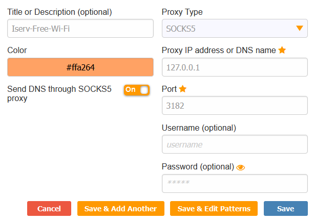

# Iserv Free Wi-Fi


A proof of concept application that tunnels trafic by uploading/downloading files to/from IServ.

**Note:
This is a proof of concept application that I developed, to test, if it is viable to use IServ as a kind of tunnel.
It should only be used if you know what you are doing and have permission to do so.\
I only decided to make this public, so that people can maybe learn something from this project** \
*Also note that I'm no longer a student and have no access to IServ anymore, so I'm unable to fix any issues, if any occur.*

## Usage

1. Download the newest [release](https://github.com/RedstoneMedia/iserv-free-wifi/releases) on the client and server machine.
2. Create a credentials.txt file with this format
```
<USERNAME>
<PASSWORD>
<AES_ENCRYPTION_KEY>
```
3. Copy the credentials file to both machines
4. Run `iserv_free_wifi.exe -s -i https://<ISERV_DOMAIN>/iserv` on the server machine. This machine has to be **outside** of the IServ network.
5. Run `iserv_free_wifi.exe -c -i https://<ISERV_DOMAIN>/iserv` on the client machine. This machine should be **inside** the IServ network (although technically it does not have to be)
6. Set up your application of choice to connect to the Socks5 server on the client. IP: 127.0.01, Port: 3182 (DO NOT PROXY ALL THE MACHINES TRAFFIC THROUGH ISERV, this will not work with Chromium or any forks, because of this)
7. Your hopefully done

## How to set up with Firefox

Using an extension like [FoxyProxy](https://addons.mozilla.org/en-US/firefox/addon/foxyproxy-standard/) is advised.\
This will allow you to turn the proxy on and off at will.\
Also make sure to send to turn on the: "Send DNS through SOCKS5 proxy" option.



It is suggested to use extensions like uBlock Origin, to reduce unnecessary traffic through IServ.

## How it works
**On the client**, this software works by acting as a local Socks5 proxy server.\
Any outgoing TCP packets will be uploaded as a file to IServ to a specific directory (encrypted of course).\
Every few seconds the client will check if there are new files uploaded to the directory, if yes
these files will be downloaded (and decrypted) and then passed to the application that is connected to the local proxy (for example, Firefox).

**The server** will also check every few seconds for uploaded packets from the client.\
It will then send these packets to the desired location and upload any response packets back to IServ, where the client can then download them

Because of this, the latency of this software is terrible.\
The bandwidth isn't that bad, which means you can attempt to download files or watch YouTube videos at 480p with no buffering, when lucky.
This can lead to a large amount of timeouts, which can lead to errors on websites (when this happens, try to reload the page).
That is why you should **NEVER** do anything important (for example online banking) while using this, because the chance of an error happening is just too big.
